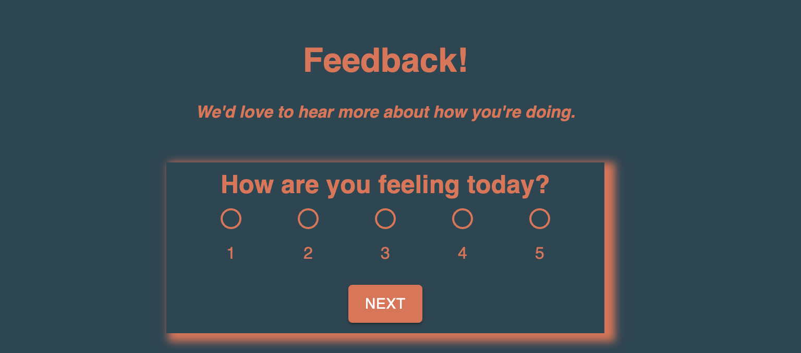
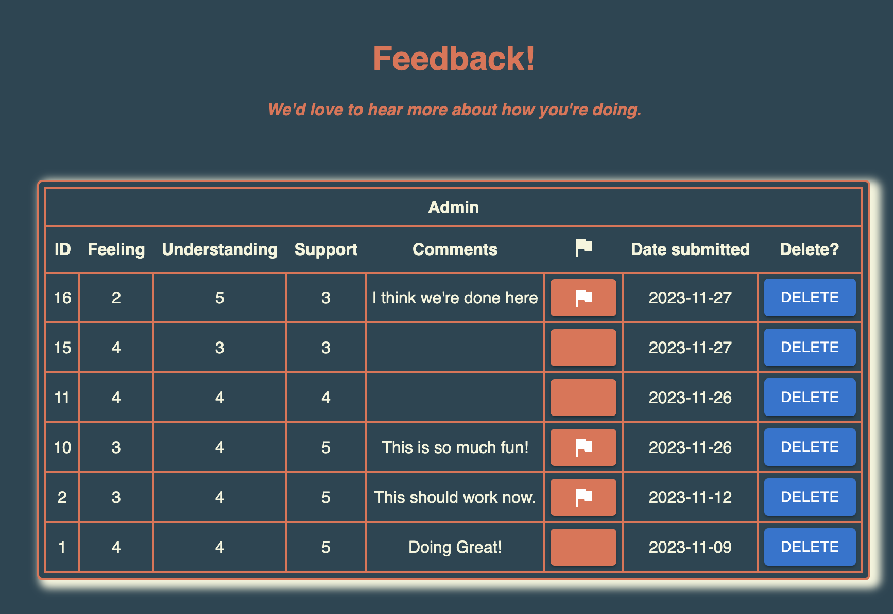

# Feedback Request form

## Description

This app is designed for the user to provide feedback on the course so far. They are able to provide a 1 to 5 value on how they're feeling, how well they are understanding the current material, and how supported they've felt on their journey. Each of these values is stored in a Redux state allowing the user to change their answers and move back and forth within the form until they are ready to submit. There is also an optional section for providing additional comments. 

Before sending their feedback to the database and clearing their values, the user is presented with a summary of their answers. Once this is submitted, they are encouraged to provide more feedback if they'd prefer.

The app administrator is able to nagivate to the /admin page of the app to review feedback from the database, with the most recent feedback listed at the top. Each user's feedback is saved and can be reviewed by the admin, deleted, or flagged for follow-up. A confirmation box pops up on deletion to ensure no records are lost via an errant click.

### Screenshot

The feeling page

### Skills practiced
Javascript
React
Redux
Material UI
Express & Node
PostgreSQL
HTML & CSS

### Steps taken to build this project
- [x] Create four React component pages
	- [x] Feeling
	- [x] Understanding
	- [x] Support
	- [x] Comments
- [x] Input values on each page
- [x] Create Redux reducers for each value
- [x] Create a Router to direct users to each page
- [x] Disallow empty input fields
- [x] Build a review page for feedback before submit
- [x] Send feedback to database via POST
- [x] Build admin page and table
- [x] Retrieve feedback from database via GET
- [x] Create delete button for feedback and confirmation window
- [x] Add new database value for flagging feedback
- [x] Improve color scheme and visibility with Material UI
- [x] Allow users to independently navigate back and forth before submitting
- [x] Ensure reducers were emptied after submission
- [x] Guide users back to start with empty values

### Built with
- Javascript
- React
- Redux
- Express & Node
- Material UI
- Postgres

### Acknowledgements
Thanks to Prime Digital Academy for expanding my knowledge into Redux

### Support
If you have suggestions or issues please email me at TBD

